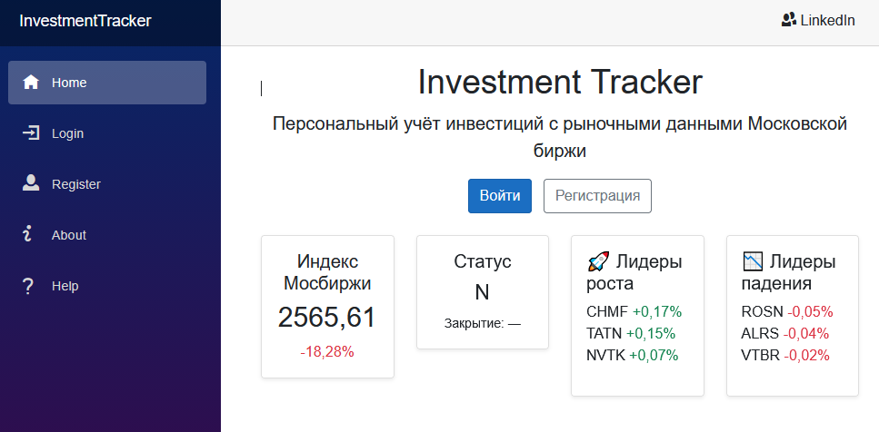
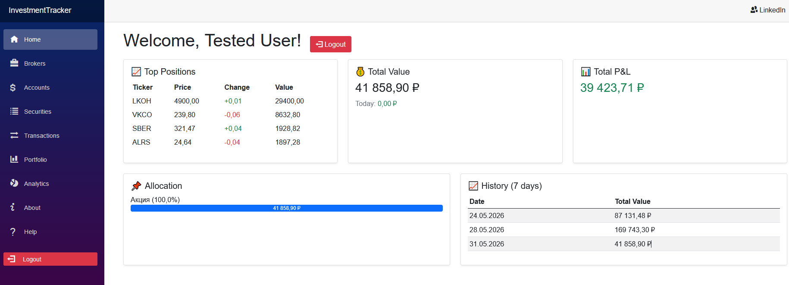
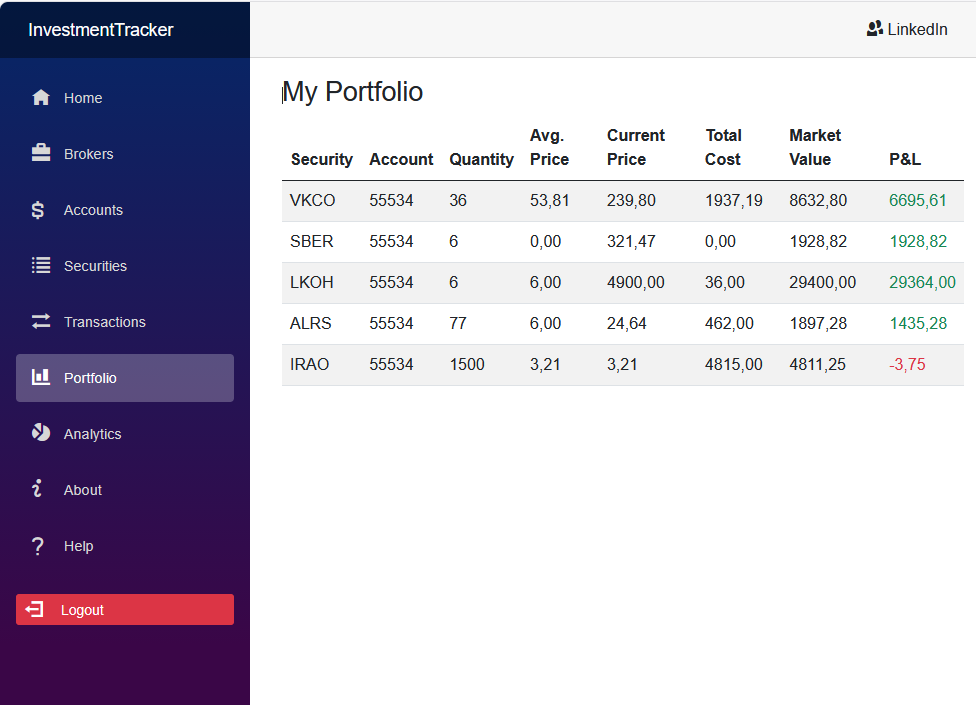
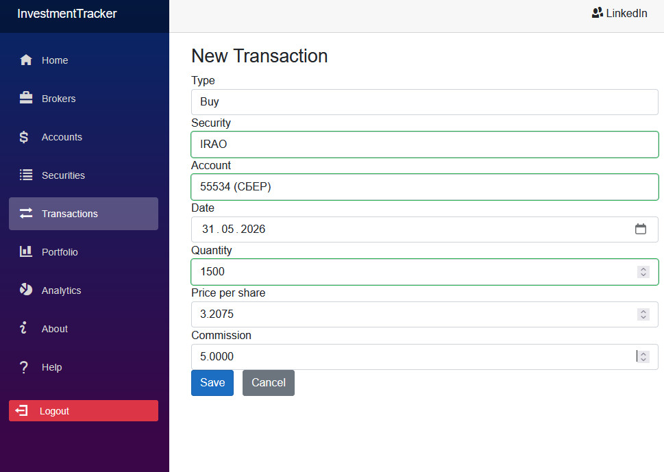
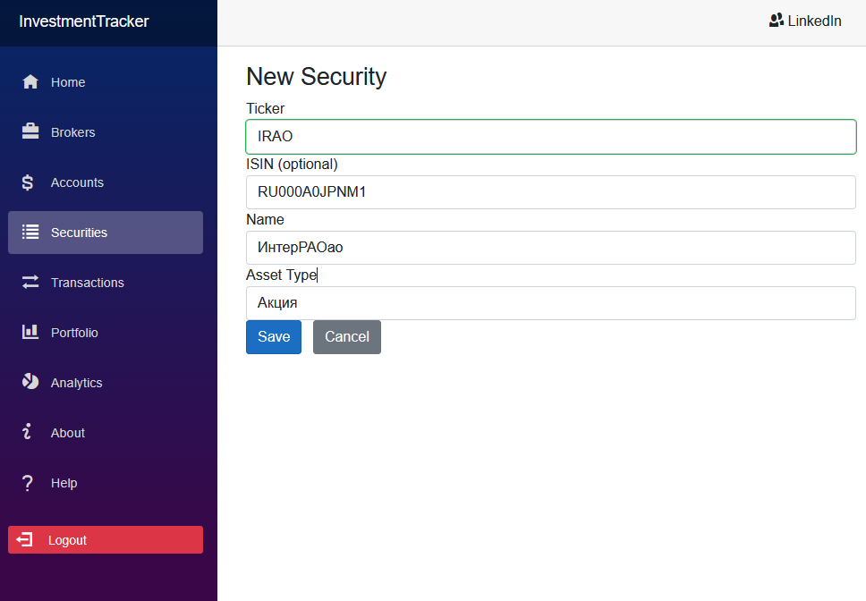
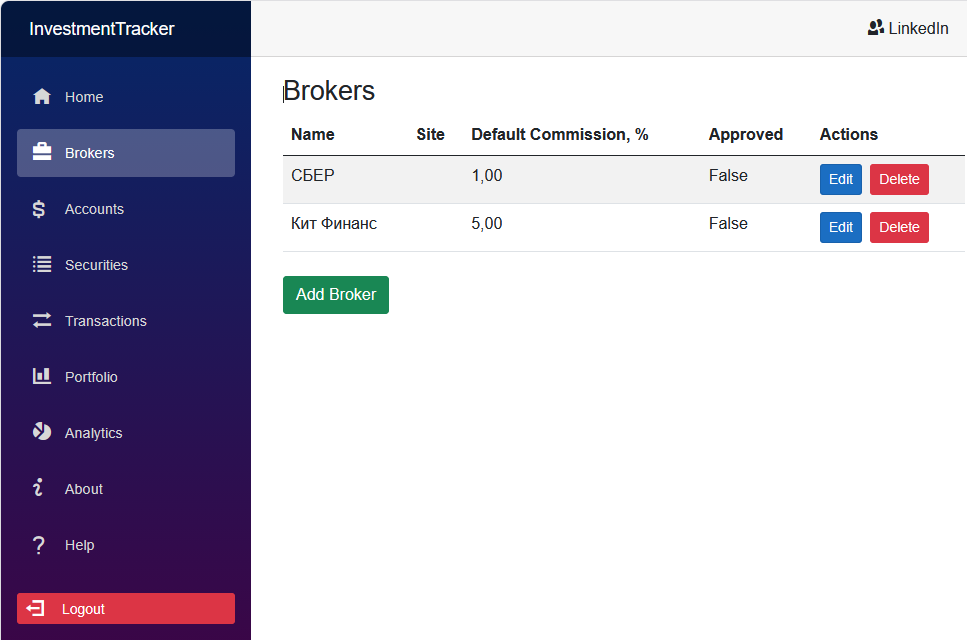
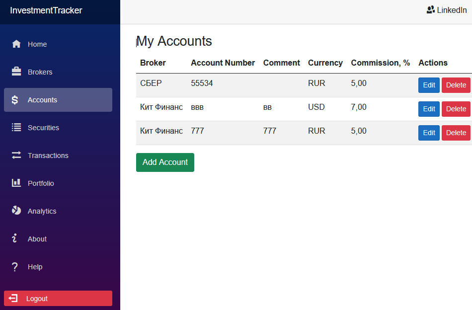
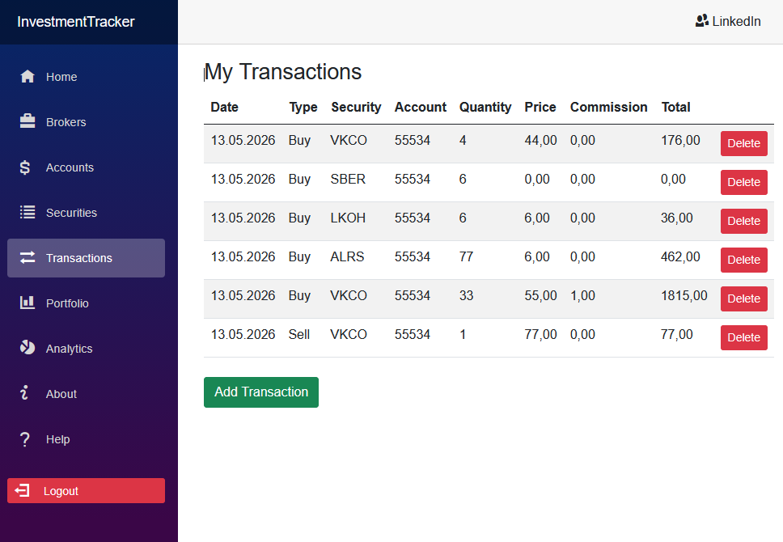
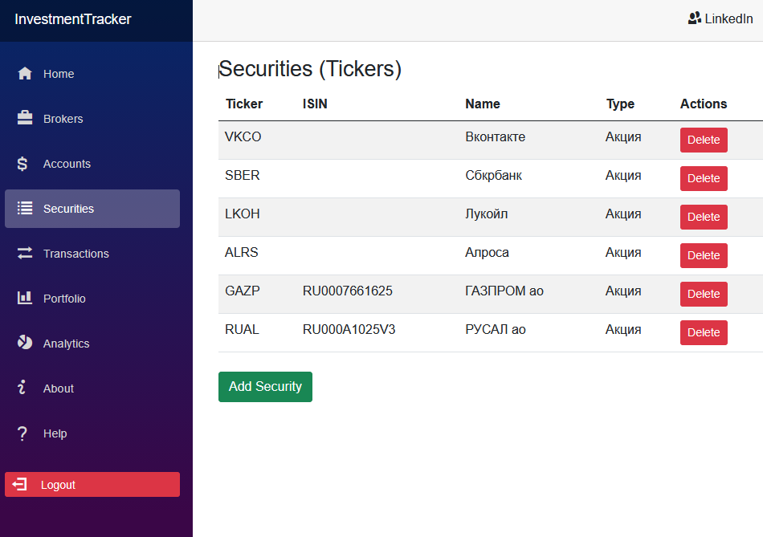

# Investment Tracker

**Персональный трекер инвестиций с рыночными данными Московской биржи в реальном времени.**


## 📖 О проекте

Investment Tracker — это full-stack pet-проект для учёта личных инвестиций. Позволяет вести портфель ценных бумаг, 
записывать сделки, отслеживать прибыль/убыток и анализировать распределение активов. 
Котировки и информация о бумагах загружаются с Московской биржи (MOEX ISS API) автоматически.

Проект создан как демонстрация современных подходов к разработке на .NET: 
Clean Architecture, JWT-аутентификация, фоновая обработка (Hangfire) и компонентный UI на Blazor.

## 🚀 Возможности

- 🔐 Регистрация и вход с JWT-токенами (ASP.NET Core Identity)
- 📋 Управление справочниками: брокеры, счета, типы активов
- 📈 Добавление ценных бумаг с автоматической загрузкой данных из MOEX
- 💼 Сделки (покупка/продажа) с автоматическим пересчётом средней цены и позиций
- 📊 Дашборд: общая стоимость, прибыль/убыток, топ-5 позиций, история портфеля
- 🏦 Публичная страница с индексом Мосбиржи, лидерами роста/падения, статусом торгов
- ⏱ Фоновое обновление котировок через Hangfire (каждые 15 минут)
- 🧩 Адаптивный интерфейс на Blazor WebAssembly с Bootstrap 5

## 🛠 Технологический стек

| Уровень       | Технологии                                                                 |
|---------------|----------------------------------------------------------------------------|
| Backend       | ASP.NET Core 8 Web API, Entity Framework Core 8, MS SQL Server (LocalDB)   |
| Frontend      | Blazor WebAssembly, Bootstrap 5                                            |
| Интеграции    | MOEX ISS API (котировки, справочники), Hangfire (фоновые задачи)          |
| Безопасность  | ASP.NET Core Identity, JWT Bearer, роли пользователей                      |
| Архитектура   | Modular Monolith (Client, Server, Shared), Clean Architecture, DI          |

## 🏗 Архитектура решения

Проект разделён на три сборки:

- **InvestmentTracker.Client** — Blazor WebAssembly SPA (интерфейс)
- **InvestmentTracker.Server** — ASP.NET Core Web API, бизнес-логика, доступ к БД
- **InvestmentTracker.Shared** — DTO, общие модели, контракты

## 📸 Скриншоты

### Гостевая страница с рыночными данными


### Дашборд после входа


### Портфель


### Добавление сделки


### Загрузка информации о бумаге с MOEX


### Список брокеров


### Управление счетами


### Сделки пользователя


### Справочник ценных бумаг


## 🔧 Запуск локально

### Предварительные требования
- .NET 8 SDK
- Visual Studio 2022 (или JetBrains Rider / VS Code)
- SQL Server LocalDB (устанавливается вместе с Visual Studio)

### Шаги
1. Клонируйте репозиторий:
   ```bash
   git clone https://github.com/your-username/InvestmentTracker.git
   cd InvestmentTracker
2. Откройте решение InvestmentTracker.sln в Visual Studio.
3. Убедитесь, что строка подключения в InvestmentTracker.Server/appsettings.json указывает на LocalDB:
 "ConnectionStrings": {
  "DefaultConnection": "Server=(localdb)\\mssqllocaldb;Database=InvestmentTracker;Trusted_Connection=True;MultipleActiveResultSets=true"
}
4. Примените миграции к базе данных. В Package Manager Console (выбрать проект InvestmentTracker.Server):
 Update-Database
5. Запустите проект (F5). Сервер запустится на https://localhost:7175 и автоматически откроет страницу входа.
6. При первом запуске будут добавлены тестовые данные: администратор (admin@example.com / Admin123!), несколько брокеров,
   бумаг и сделок.

**Дополнительно**

Swagger UI доступен по адресу /swagger
Панель Hangfire для мониторинга фоновых задач — /hangfire
Для ручного обновления котировок нажмите "Trigger now" на recurring job в Hangfire

**Тестовые данные**

После миграции и первого запуска в базе автоматически создаются:
Валюты: RUR, USD, EUR, CNY
Типы активов: Акция, Облигация, ПИФ, ETF
Пользователь-администратор
Несколько брокеров (Сбер, Тинькофф, ВТБ) и их счета
Ценные бумаги (SBER, GAZP, LKOH, VTBR) с историческими котировками
Пример сделок для демонстрации портфеля

**Планы по развитию**
Графики стоимости портфеля и распределения активов (ChartJs.Blazor)
Мультиязычность интерфейса
Экспорт отчётов в Excel
Уведомления о целевых ценах (SignalR)
Мобильное приложение на .NET MAUI

## 📄 Лицензия
Проект распространяется под лицензией MIT. См. файл [LICENSE](LICENSE.txt).

**Автор:** Александр Литвин ([LinkedIn](https://www.linkedin.com/in/alexander-litvin-0420a51b6/) | [Email](mailto:litvin_alexander@mail.ru))

## 🎬 Демонстрация работы

[](https://drive.google.com/file/d/10BN_53PCPWZ912DTVMTX-pBVS18-oJLz/view?usp=drive_link)

Нажмите на изображение выше, чтобы посмотреть видео (2 минуты).